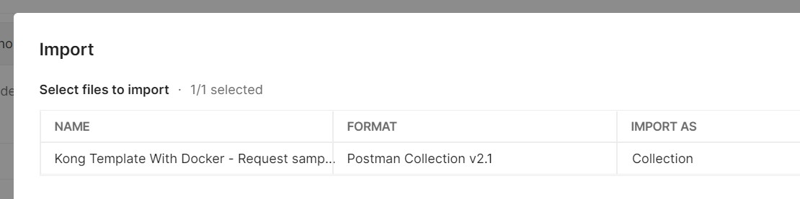
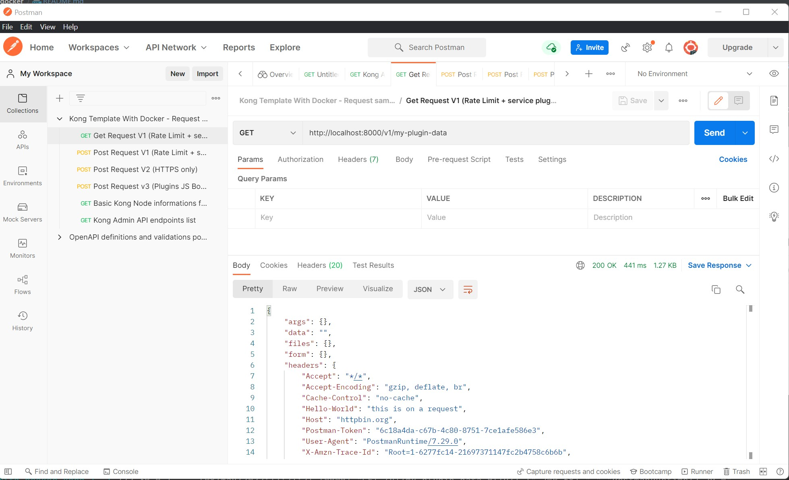

Kong plugin template WITH DOCKER / DOCKER COMPOSE (and JavaScript plugin running with kong-js-pdk) running on a DBLESS Kong 3.3.1 installation
====================

## TLDR fast instructions

- Install Docker Engine (a version with Docker Compose support)
- Clone this repo
- At the root folder run ` docker-compose up -d `
- Smile and fire request to the routes and see custom plugins in action ( GET http://localhost:8000/v1/my-plugin-data or POST http://localhost:8000/v3/my-plugin-data)
- Open the of one the plugins, change anything
- Run ` docker-compose restart ` (or down and up) and make the requests again to see your changes applied
- you can also import a postman collection with a few request samples to the routes exposed in this kong installation, just go to the folder "postman" to get the json file. Import it in your postman in "File -> Import" menu.

After importing the collection you should see something like this:

## Now, the README....

This repository contains a simple Kong plugin template to get you
up and running quickly for developing your own plugins.

In fact, this "template" has two custom plugin samples both installed and activated, one in Lua and the other
using JavaScript, running in the new kong-js-pdf (please check here https://www.npmjs.com/package/kong-pdk
and also here https://github.com/Kong/kong-js-pdk). The template is also configured to use the new 3.3.1 release
of Kong (using 2.8.1-alpine docker image).

There are two JS plugins here:

- js-hello: This is an example plugin that add some headers to the response
- js-body-validation: This is an example plugin that prints body content and perform some validation on it

There is also a Lua plugin contained in this template that was designed to work with
[`kong-pongo`](https://github.com/Kong/kong-pongo).

This project is a fork of the original kong plugin template project (https://github.com/Kong/kong-plugin) with the addition of Docker setup for Kong itself (with two custom JS plugins already activated in one service and a third one activated only in a route) and kong-js-pdk (needed to run the JavaScript plugin samples).

To start the containers:
`docker-compose up` or `docker-compose up --build` or `docker-compose up -d`

You need the following ports available:
- 8000 (Kong the API Gateway)
- 8001 (Kong Admin API)
- 8444

Now you can make a request to a route and see one of the the activated plugin in action.
To perform this, just make a GET request to (http://localhost:8000/v1/my-plugin-data).

You can also make POST requests to the URL http://localhost:8000/v3/my-plugin-data to see a JS plugin performing some body validation and printing.

To confirm the plugin is activated and working, look the response headers or check the logs being printed in the terminal (running docker-compose with -d flag).

To stop the containers:
`docker-compose down`

### TODO LIST
- Add a fourth plugin to the mix, written in TypeScript
- Add a fifth plugin to the mix, written in Go
- Add unit-testing, integration-testing and code coverage verification for the JavaScript plugin
- Run some load tests to compare Lua x JS plugins performance in some scenarios
- Some dockerized setup to make it possible to run Pongo tests without having to install Pongo tooling manually. Installing Pongo is very easy (specially on Linux) but.... you know.... just to make it easier even if you are on Windows without WSL2 support enabled.
- Add more complex plugins samples that does something really useful for mankind, like printing ASCII talking-cows to your consoles and logs like cowsay ( https://github.com/piuccio/cowsay )
